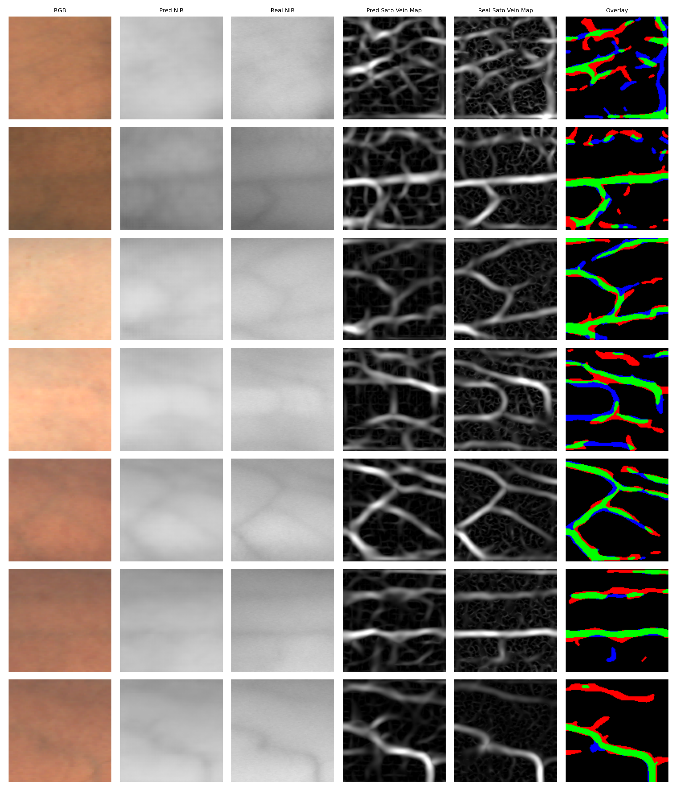

# Pix2Pix RGB-to-NIR cGAN

PyTorch implementation of a pix2pix conditional GAN for translating 128x128 RGB
skin crops into NIR-like grayscale images.

The repository includes training, evaluation, and single-image inference tools.
The trained generator is distributed through GitHub Releases so the git
repository stays lightweight.

## Publication

This implementation accompanies:

Keivanmarz, A., and Sharifzadeh, H. (2024). Vein pattern visualisation for
biometric identification with cGAN on a New Zealand dataset. Forensic Science
International, 359, 112050.

- DOI: https://doi.org/10.1016/j.forsciint.2024.112050
- ScienceDirect: https://www.sciencedirect.com/science/article/pii/S0379073824001312

## Data Availability

The RGB/NIR dataset used in this work is available upon reasonable research
request. For access enquiries, please contact:

- Hamid Sharifzadeh: hsharifzadeh@unitec.ac.nz
- Ali Keivanmarz: akeivanmarz@unitec.ac.nz

## Install

```bash
git clone https://github.com/alikeivanmarz/pix2pix-rgb2nir-cgan.git
cd pix2pix-rgb2nir-cgan
python -m venv .venv
source .venv/bin/activate
python -m pip install --upgrade pip
python -m pip install -e .
```

On Apple Silicon, install a PyTorch build with MPS support before running
training or inference.

## Download Weights

```bash
python scripts/download_weights.py --variant fp32
```

This downloads:

```text
weights/rgb2nir-pix2pix-generator-fp32.safetensors
```

An fp16 release asset is also provided for lighter local testing:

```bash
python scripts/download_weights.py --variant fp16
```

## Predict One Image

Input images should be RGB skin crops, preferably square crops of hand or
forearm skin. The script accepts common image formats supported by Pillow, such
as PNG, JPEG, TIFF, BMP, and WebP. Images are converted to RGB and resized to
128x128 by default before inference.

```bash
python scripts/predict_image.py \
  --weights weights/rgb2nir-pix2pix-generator-fp32.safetensors \
  --input path/to/rgb_crop.png \
  --output outputs/nir_prediction.png
```

Functional test with the included synthetic crop:

```bash
python scripts/predict_image.py \
  --weights weights/rgb2nir-pix2pix-generator-fp32.safetensors \
  --input examples/rgb_synthetic_skin_crop.png \
  --output outputs/nir_prediction.png
```

Use Apple Silicon MPS explicitly:

```bash
python scripts/predict_image.py \
  --device mps \
  --weights weights/rgb2nir-pix2pix-generator-fp32.safetensors \
  --input path/to/rgb_crop.png \
  --output outputs/nir_prediction.png
```

Use an exact 128x128 input without resizing:

```bash
python scripts/predict_image.py \
  --weights weights/rgb2nir-pix2pix-generator-fp32.safetensors \
  --input path/to/rgb_crop_128.png \
  --output outputs/nir_prediction.png \
  --no-resize
```

See [docs/inference.md](docs/inference.md) for input preparation, supported
formats, output details, and troubleshooting.

## Model

- Generator: U-Net, RGB input to single-channel NIR-like output
- Discriminator: 70x70 PatchGAN
- Objective: BCE adversarial loss plus `100 * L1`
- Input size: 128x128
- Tensor range: `[-1, 1]`
- Vein visualisation: Sato vesselness maps from predicted and paired NIR crops
- Detail, vessel, and high-pass loss hooks are available in code; the released
  config keeps those lambdas at `0.0`.

## Results

Evaluation uses the released fp32 generator weights and the full
participant-disjoint selected-clean test split: 19,323 crops from 45 subjects.
Full provenance, manifest hashes, baselines, and per-subject results are in
[reports/reproducible_evaluation/evaluation_summary.md](reports/reproducible_evaluation/evaluation_summary.md).

Crop-level mean metrics:

| Method | MAE | RMSE | PSNR | SSIM |
| --- | ---: | ---: | ---: | ---: |
| pix2pix cGAN | 0.0464 | 0.0519 | 27.7760 | 0.9009 |
| mean/std luminance baseline | 0.0744 | 0.0829 | 23.0867 | 0.8884 |
| RGB luminance baseline | 0.2159 | 0.2204 | 14.5618 | 0.8043 |
| green-channel baseline | 0.2689 | 0.2733 | 12.1283 | 0.7556 |
| train-mean NIR baseline | 0.0885 | 0.0993 | 21.1980 | 0.8890 |

Subject-averaged metrics:

| Method | Subjects | MAE | RMSE | PSNR | SSIM |
| --- | ---: | ---: | ---: | ---: | ---: |
| pix2pix cGAN | 45 | 0.0460 | 0.0510 | 27.7686 | 0.9032 |
| mean/std luminance baseline | 45 | 0.0730 | 0.0813 | 23.2546 | 0.8885 |
| RGB luminance baseline | 45 | 0.2114 | 0.2159 | 14.7263 | 0.8087 |
| green-channel baseline | 45 | 0.2645 | 0.2688 | 12.2677 | 0.7607 |
| train-mean NIR baseline | 45 | 0.0853 | 0.0960 | 21.4508 | 0.8910 |

Full-test Sato vein-map metrics:

| Method | Vessel corr | Vessel Dice | Vessel IoU | Skeleton F1 |
| --- | ---: | ---: | ---: | ---: |
| pix2pix cGAN | 0.5074 | 0.5026 | 0.3509 | 0.1187 |
| mean/std luminance baseline | 0.3983 | 0.4304 | 0.2846 | 0.0936 |
| RGB luminance baseline | 0.3983 | 0.4304 | 0.2846 | 0.0936 |
| green-channel baseline | 0.3219 | 0.3858 | 0.2490 | 0.0824 |
| train-mean NIR baseline | 0.1084 | 0.1872 | 0.1085 | 0.0737 |

Example qualitative grid:



## Train

Prepare a CSV manifest with these columns:

```text
participant,source_split,category,base,hand,x,y,pair_id,rgb_path,nir_path
```

Then edit `configs/pix2pix_mps.yaml` so `crop_root`, `train_csv`, `val_csv`,
and `test_csv` point to your local dataset.

```bash
python scripts/train_pix2pix.py \
  --config configs/pix2pix_mps.yaml \
  --run-name pix2pix_train
```

## Evaluate

Reproduce the benchmark tables with release weights, train/test manifests, and
baseline comparisons:

```bash
python scripts/evaluate_benchmarks.py \
  --weights weights/rgb2nir-pix2pix-generator-fp32.safetensors \
  --train-csv manifests/train_fit_selected_clean.csv \
  --test-csv manifests/test_selected_clean.csv \
  --crop-root data/crops/selected/clean \
  --output-dir reports/reproducible_evaluation \
  --include-vein
```

For direct checkpoint evaluation without baselines:

```bash
python scripts/evaluate_pix2pix.py \
  --config configs/pix2pix_mps.yaml \
  --checkpoint runs/pix2pix_train/checkpoints/best.pt
```

## Export Release Weights

Training checkpoints include optimizer and discriminator state. For public
distribution, export generator-only safetensors:

```bash
python scripts/export_inference_weights.py \
  --checkpoint runs/pix2pix_train/checkpoints/best.pt \
  --output-dir release_assets \
  --include-fp16
```

Upload the generated `.safetensors` files and `checksums.sha256` to a GitHub
Release.
